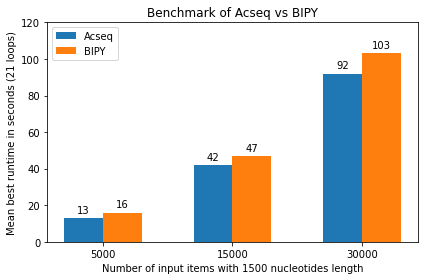

# rfessentials
Reading frame essentials (rfessentials) contains code with functions used for determining aminoacids, corresponding basepairs from DNA sequences. Functions to determine open reading frames will also be added later on.

Functions include: acseq (see README)

# Help and support
The preferred way to get support is through the Github issues page.

Reach out to me at one of the following places!

GitHub
mail@julianarts.nl
